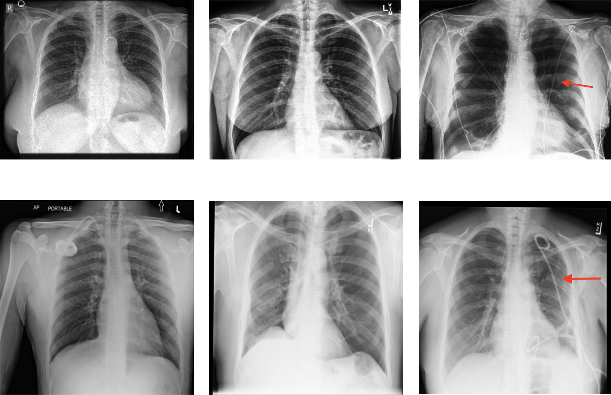

## Detecting Shortcuts in Medical Images - A Case Study in Chest X-rays
#### by Amelia Jiménez-Sánchez, Dovile Juodelyte, Bethany Chamberlain, Veronika Cheplygina

This repository provides a PyTorch implementation of our work accepted at ISBI 2023 -> [[**PDF**]](https://ieeexplore.ieee.org/document/10230572) [[**arXiv**]](https://arxiv.org/abs/2211.04279) 

## Overview 
Data-centric approaches, bias assessment, and validation are increasingly important as datasets get larger, but are still understudied in medical imaging. We review the literature and present a validation study on detecting shortcuts in chest X-rays. Our systematic experiments on two large benchmarks generalize earlier findings which show overoptimistic and biased performance. We share our code and a set of non-expert drain labels for CheXpert dataset under the `preprocess` folder.

<p align="center"></p>

## Usage
### 1. Cloning the repository
```bash
$ git clone https://github.com/ameliajimenez/shortcuts-chest-xray.git
$ cd shortcuts-chest-x-ray/
```

### 2. Preprocessing: create development subsets
Detailed steps under `preprocess` folder.

### 3. Training, testing & visualizations
Detailed steps under `bin` folder.

## Citation
If this work is useful for your research, please cite our [paper](https://arxiv.org/abs/2211.04279):
```
@INPROCEEDINGS{10230572,
  author={Jiménez-Sánchez, Amelia and Juodelyte, Dovile and Chamberlain, Bethany and Cheplygina, Veronika},
  booktitle={2023 IEEE 20th International Symposium on Biomedical Imaging (ISBI)}, 
  title={Detecting Shortcuts in Medical Images - A Case Study in Chest X-Rays}, 
  year={2023},
  volume={},
  number={},
  pages={1-5},
  doi={10.1109/ISBI53787.2023.10230572}}
```

## Acknowledgments
Our repository is based on [jhealthcare/CheXpert](https://github.com/jfhealthcare/Chexpert) and [purrlab/hiddenfeatures-chestxray](https://github.com/purrlab/hiddenfeatures-chestxray). We thank Kasper Thorhauge Grønbek and Andreas Skovdal for early discussions and providing the labels used in our experiments.
